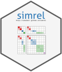

.. PySimrel documentation master file, created by
   sphinx-quickstart on Sat Aug 17 23:38:33 2019.
   You can adapt this file completely to your liking, but it should at least
   contain the root `toctree` directive.

Welcome to PySimrel's documentation!
========================================

PySimrel is a python package for simulating linear model data.

.. toctree::
   :maxdepth: 4
   :caption: Content

   quickstart
   simrel
   functions

Indices and tables
==================

* :ref:`genindex`
* :ref:`modindex`
* :ref:`search`
